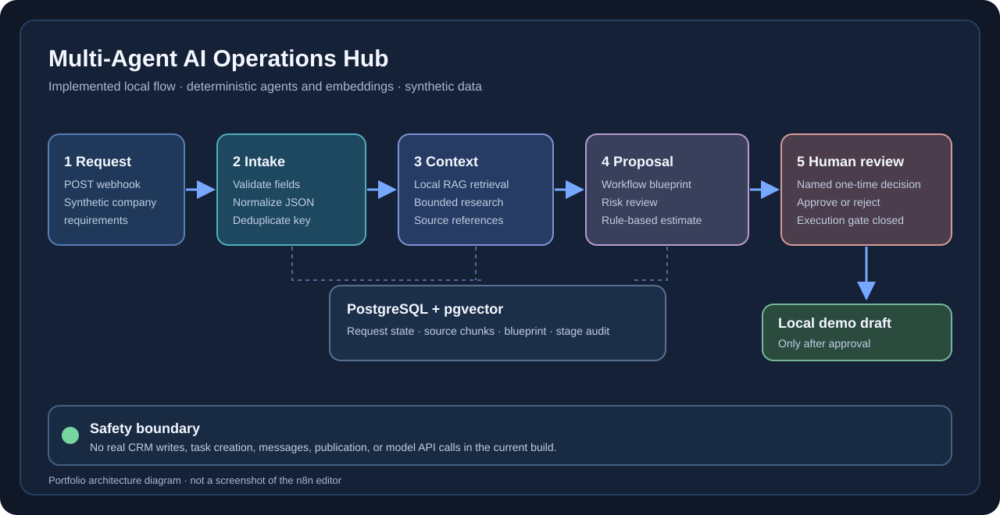
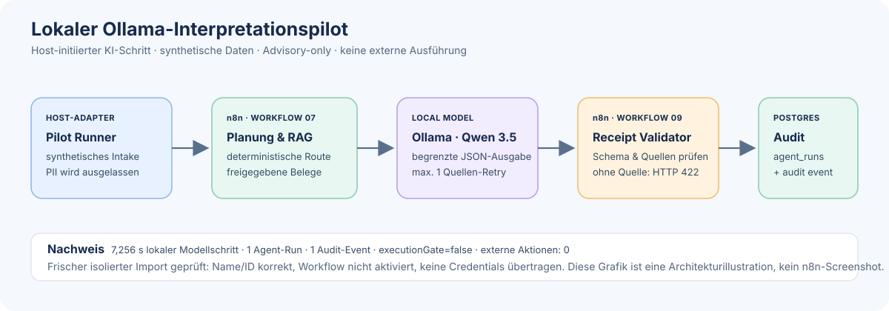

# Multi-Agent AI Operations Hub

A production-minded local portfolio project that turns an unstructured automation request into a reviewed, testable implementation blueprint.

*The diagram depicts the central deterministic workflow. A separate host-side local Ollama pilot is documented below; this image is an architecture illustration, not a screenshot of the n8n editor.*

## Why this project exists

Automation agencies and internal operations teams often receive incomplete requests such as: "Connect our lead form to the CRM and add AI." The difficult part is not drawing nodes on a canvas. It is discovering missing requirements, selecting safe integrations, estimating effort, documenting risks, and keeping a human in control.

This system demonstrates those capabilities end to end.

## What you can see in a demo

A synthetic request reaches `POST /webhook/operations-hub`. The workflow validates and deduplicates it, retrieves source-labelled local knowledge, prepares a structured proposal, records six stage audit events, and returns HTTP 202 with `awaiting-human-review`. A separate endpoint records one named approve/reject decision. Approval prepares a local synthetic draft; it performs no external action. The [demo runbook](docs/DEMO_RUNBOOK.md) includes a complete example request and the expected response states.

## Intended flow

1. Intake Agent validates and structures the request.
2. Research Agent gathers approved company and tool context.
3. RAG Agent retrieves relevant internal implementation knowledge.
4. Solution Architect Agent proposes the workflow and API design.
5. Risk Reviewer checks privacy, failure modes, and approval gates.
6. Estimator calculates effort and expected running cost from rules.
7. A human approves or rejects the proposal.
8. After a named human decision, the local demo adapter prepares a synthetic draft. Real CRM writes, task creation, messaging, and publication are deliberately out of scope.

## Quality goals

- Bounded agent responsibilities instead of one unrestricted agent
- JSON Schema contracts between every stage
- Human approval before external or irreversible actions
- Idempotency, retries, error paths, and an audit trail
- Prompt and workflow versioning
- Cost, latency, and token tracking
- Automated evaluation cases, including deliberate failures
- Synthetic demo data only

## Current implementation status

The public portfolio version includes:

- Deterministic intake validation, idempotency, request persistence, and clear 202/422 responses
- A five-document synthetic knowledge base and PostgreSQL/pgvector ingestion and retrieval
- Bounded local research, solution blueprinting, risk review, and rule-based effort estimation
- A central n8n workflow that persists a pending blueprint, advances request state, and records six sanitised per-stage audit events
- A separate named, one-time approve/reject endpoint; approval creates only a synthetic local draft proposal
- Protection against repeated or cross-request decisions, with HTTP 409, version-bound approval records, and a fail-closed external-execution gate
- Strict type and deadline validation, audited rejected intakes, a minimum retrieval threshold, and stale RAG-chunk cleanup
- 30 synthetic end-to-end scenarios plus unit, contract, export, RAG, and workflow tests

The agents in published n8n workflow `07` remain deterministic demonstrations, not LLM-backed production agents. Embeddings are a repeatable local hash baseline, not semantic production embeddings. A separate, host-initiated [local Ollama interpretation adapter](docs/AI_EXTENSION.md) is connected to published receipt workflow `09`: it consumes approved excerpts returned by `07`, validates the model's advisory JSON, and persists an agent-run and audit event. Its local trigger rule resolves explicitly stated events and leaves ambiguous cases to the model. The current adapter makes at most one extra local citation check and stops outputs that still lack a source; the published local receipt independently rejects an empty source list. The response exposes cited excerpts for a human to assess; source-ID validity is not proof of semantic support. Earlier synthetic evaluations and the later development rerun are [documented separately](docs/LOCAL_LLM_EVALUATION_REPORT.md). The model does not run inside n8n, and no real CRM, project-management, email, or messaging integration is enabled.

*Workflow 09 is a separate receipt-and-audit workflow. This is an architecture illustration, not an editor screenshot; the fresh isolated import verified the workflow identity and that it remained inactive.*

## Local stack

- n8n Community Edition
- PostgreSQL with pgvector
- Docker Compose
- JavaScript / Node.js
- Optional local Ollama model API called by the host adapter; workflow `09` receives and audits its result; separate paid OpenAI adapter remains mock-tested only

Both published demo routes should remain on the local machine. The Compose file binds n8n and PostgreSQL to `127.0.0.1`; the currently running n8n listener was verified on `127.0.0.1:5680`. If a stack was created from an older Compose version, check its actual port binding before using it.

## Quick start

1. Copy `.env.example` to `.env` and replace local placeholders as needed.
2. Start the pinned local services with `docker compose up -d` or `START_LOCAL.cmd`.
3. Open n8n at `http://localhost:5680` and complete the local owner setup if prompted.
4. The local startup script imports workflow `01` only if no workflow with that name exists. Import workflow `00` and execute its migration once, then import and publish `02`, `03`, `05`, `06`, `07`, and `08` from `workflows/`. `IMPORT_RAG_WORKFLOWS.cmd` imports `00` and `02` only when missing. Workflow `04` is an optional manual synthetic-data maintenance flow. Select the local PostgreSQL credential on each database node that needs it.
5. Publish workflow `02`, then seed the five synthetic knowledge documents with `powershell.exe -NoProfile -ExecutionPolicy Bypass -File .\scripts\seed-knowledge-base.ps1`.
6. Run `node --test` to verify the contracts, agents, evaluation scenarios, and embedded workflow code.
7. With workflows `07` and `08` published, run `powershell.exe -NoProfile -ExecutionPolicy Bypass -File .\scripts\smoke-test-operations-hub.ps1` for synthetic live tests of planning, approval, rejection, idempotency, and error responses. Each run adds two synthetic requests and their audit rows to the local database; it does not clean them up.
8. Optionally, with Ollama running and `qwen3.5:4b` downloaded, run `node scripts/evaluate-local-ai-interpretation.mjs --cases=6` for the historical pilot. With workflows `07` and `09` published and the existing PostgreSQL credential selected on `09`, run `node scripts/run-local-ollama-n8n-pilot.mjs --live` for one synthetic host-initiated end-to-end run. Each live run creates one synthetic request, one agent-run row, and one audit event; it does not use a paid model or perform external actions.
9. To reproduce the 20-case development/regression evaluation, use `node scripts/evaluate-local-ai-interpretation.mjs --suite=regression-v1`; for the latest prelabelled 15-case snapshot, use `node scripts/evaluate-local-ai-interpretation.mjs --suite=validation-v4`. Each makes local Ollama calls and prints raw-model and selected trigger, citations, clarifications, latency, token metrics, and controlled stops. Responses are not written to disk. The `validation-v4` set was run once after the citation adapter was frozen and is now disclosed; future changes need a new independent set.

For an existing local stack, `IMPORT_RAG_WORKFLOWS.cmd` checks the local workflow list and imports the versioned RAG migration and knowledge-ingestion workflow only if each name is missing; if the list cannot be read, it stops rather than risk creating duplicates. This imports local workflow definitions only; it does not send data elsewhere or call a paid AI service. The RAG/review endpoints are local demo routes; do not expose them publicly.

Never commit `.env`, API keys, credentials, or real customer data.

The existing local folder name `automation-project-planner` is intentionally retained to preserve the earlier work. The public project name is **Multi-Agent AI Operations Hub**.

## Portfolio deliverables

Already in this local project folder:

- [Implemented architecture and safety boundaries](docs/ARCHITECTURE.md)
- Exported, sanitized n8n workflows
- Local Docker Compose setup and setup instructions
- 30 synthetic end-to-end scenarios and 178 passing automated tests, including strict handoff, approval-binding, AI-adapter, citation-gate, local n8n receipt, and isolated-import guard tests
- GitHub Actions CI definition to run the Node.js suite on pushes and pull requests
- [Reproducible synthetic demo and failure-path runbook](docs/DEMO_RUNBOOK.md)
- [Authentic n8n workflow screenshots](docs/screenshots/README.md) for the published planning and human-review workflows
- [Measured local latency evaluation and limits](docs/LOCAL_EVALUATION_REPORT.md)
- [Opt-in AI interpretation pilot and six historical synthetic cases](docs/AI_EXTENSION.md), plus [measured local Ollama results, development suites, independent validation snapshots, and documented limitations](docs/LOCAL_LLM_EVALUATION_REPORT.md)
- [Host-initiated local Ollama-to-n8n pilot](docs/LOCAL_OLLAMA_N8N_INTEGRATION.md), including the published receipt workflow `09` and two successful synthetic live runs
- [Isolated clean-stack boot and workflow-import check](scripts/verify-isolated-start.ps1) that preserves the normal stack and all volumes (user-run: fresh volumes, both containers healthy, host `/healthz` HTTP 200, and workflow `09` imported with its inactive state verified; no credentials or webhook activation)
- [German and English portfolio summary](docs/PORTFOLIO_SUMMARY.md)
- [Current readiness, verified checks, and remaining release steps](docs/PROJECT_STATUS.md)
- [Phase 12 implementation and verification report](docs/PHASE_12_HUMAN_REVIEW_API_REPORT.md)

Deliberately not included in this portfolio release:

- LLM integration inside the published n8n workflow: the local model was measured only through a standalone adapter, not as part of the live webhook route
- Full clean-start verification of all published workflows, credential mapping, and webhook behavior: the isolated run verified only workflow `09` import and its inactive state, intentionally without importing credentials or activating a webhook
- Credentials, real customer data, public webhooks, and autonomous writes to external systems

A recorded video is optional. The reproducible live demo and a clear explanation of the workflow are sufficient for this portfolio version.

**Portfolio claim boundary:** Describe this version as a tested, local automation and agent-orchestration prototype with a separate real local-LLM interpretation pilot. Do not describe it as a deployed AI-agent service, an LLM-backed n8n workflow, semantic LLM/RAG evaluation, or an integration that writes to real customer systems. The [status report](docs/PROJECT_STATUS.md) records verified evidence and remaining release checks.

## Authorship and AI assistance

Nico Joschke owns the project concept, architecture decisions, safety boundaries, test interpretation, documentation, and ability to explain the system. AI-assisted development tools were used during implementation and review. The checked-in tests, explicit limitations, and reproducible local setup are the evidence; generated code is not presented as proof by itself.

## Local API routes

- `POST http://localhost:5680/webhook/operations-hub` accepts a synthetic project request and returns a blueprint with `awaiting-human-review`.
- `POST http://localhost:5680/webhook/operations-hub-review` accepts `{ "requestDbId": "<UUID>", "decision": "approved|rejected", "reviewer": "Synthetic Reviewer" }`. Approval prepares a local draft proposal only. Do not expose this local demo endpoint publicly.
