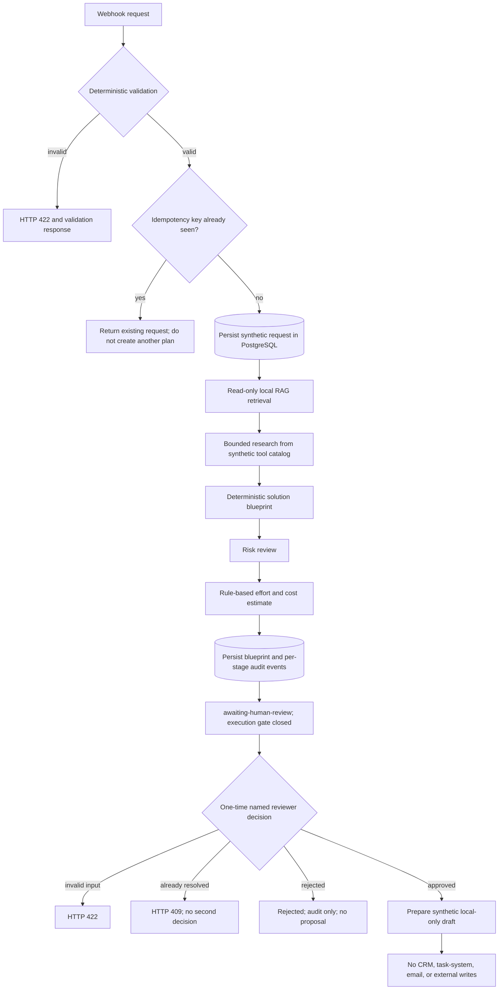

# Architecture

## Design principle

Use deterministic workflow logic for validation, routing, permissions, retries, persistence, and calculations. Use language models only for tasks that benefit from interpretation or generation.

## Components

- **n8n:** orchestration, API calls, routing, retries, and approval waits
- **PostgreSQL:** project state, structured outputs, agent runs, and audit events
- **pgvector:** retrieval of relevant implementation knowledge
- **Model API:** reserved for a later explicitly configured phase; the current agents are deterministic and incur no API cost
- **Human reviewer:** explicit approval boundary before any CRM write, message, or publication; the current local build performs none of those external actions

## Agent boundaries

| Agent | Allowed responsibility | Explicitly not allowed |
|---|---|---|
| Intake | Extract requirements and missing fields | Choose tools or publish a solution |
| Research | Gather approved context and cite sources | Contact companies or invent facts |
| RAG | Retrieve internal implementation knowledge | Modify the knowledge base |
| Solution Architect | Produce a structured blueprint | Execute external actions |
| Risk Reviewer | Identify risks and required controls | Silently approve its own findings |
| Estimator | Apply documented effort and cost rules | Invent commercial prices |
| Execution adapter | Prepare a synthetic local draft only | Write to real CRM/task systems or send messages |

## Safety and reliability

- Every request has an idempotency key.
- Every stage writes status and errors to the audit trail.
- Agent outputs must validate against JSON Schema.
- Timeouts and transient API errors use limited retries with backoff.
- Sensitive or ambiguous requests require human review.
- No email or external message is sent automatically in the portfolio version.
- Test data is synthetic and credentials are never committed.

## Implemented local workflow split

1. `01-intake-api`: validate, normalize, persist, and audit requests
2. `02-knowledge-ingestion-api`: ingest synthetic knowledge with stable source and chunk identity
3. `03-rag-retrieval-api`: read-only local retrieval from pgvector
4. `05-research-brief-api`: bounded research against a local synthetic tool catalog
5. `06-audit-event-api`: validate and persist minimised audit events
6. `07-central-operations-hub`: connect intake, RAG, research, blueprint creation, risk review, estimate, persistence, and per-stage audit
7. `08-operations-hub-review-api`: record a one-time named approval/rejection and prepare a local-only synthetic draft on approval

The central workflow ends at `awaiting-human-review`. The local review endpoint accepts one named decision for a pending blueprint, writes an audit record, and blocks repeated decisions. Approval prepares only a synthetic local draft proposal; it does not perform external execution. No model API, real CRM, task service, or messaging integration is active. The diagram above shows the implemented deterministic baseline, not a live multi-LLM agent system.
